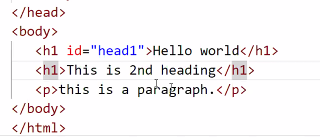

# CSS: to style a page

## **Syntax:**

# **Selector** ---->  
- to select on which tag/element u want to apply css ..eg. h1, p.

- e.g.

- h1{
    property-name: value;
}

- h1{ color: red;}

- It is always recommended to put style tag in head tag cos whenever the html page loads on the browser it will first load tge head tag, now the head tag will prepare the style to be applied. now when the body starts loading then body has not to wait

- 
## **Types of selector:**
1. **Tag selector:** name of the tag as selector
    - h1{}, p{}, form{}

2. **Id Selector:** id of tag as a selector
    - to identify uniquely
    - `
 
`

    
    

3. **Class Selector:**
    - 
    - 
    - Class of a tag as a selectir.
    - to identify few elements commonly.
    - 

4. **Universal selector:** 
    - *{......}
    - It will select all the tags.
    - 

## preference order of selector:
- id > class > tag > *

#
# Types Of CSS:

### **1. Internal CSS:**
    - Written inside the .html file and encapsulated in head tag.

### **2. External CSS:**
    - CSS written in a separate css file
    - and link that file in head section of html using
    - `<link rel="stylesheet" type="text/css" href="Style.css">`
    - 

### **3. Inline CSS:**
    - 

inline>internal>external