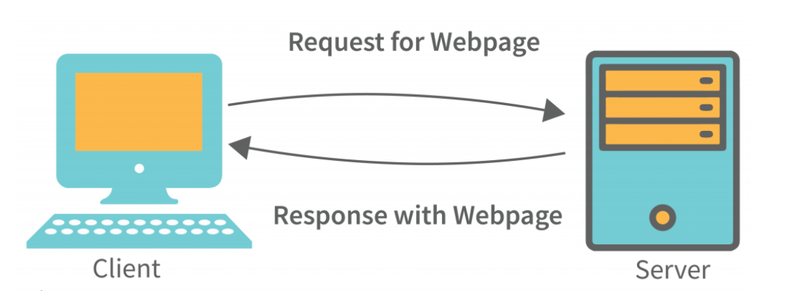
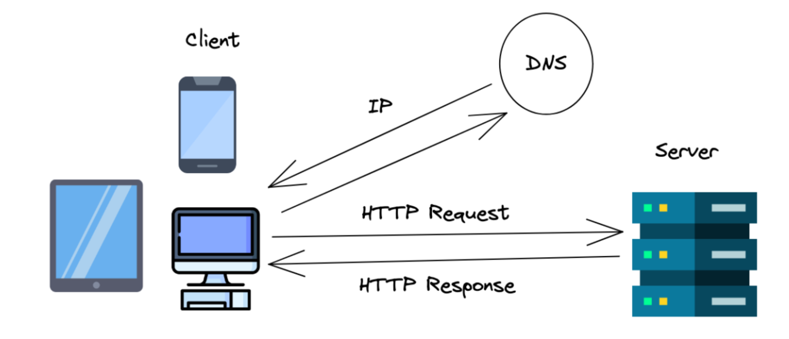

# Web Applications

Web applications are software applications that are accessed through a web browser over a network, such as the Internet. They leverage web technologies for user interaction and data management.

## Desktop Apps
- **Definition**: Applications that run locally on an operating system (OS), such as Windows, macOS, or Linux.
- **Installation**: Users must download and install desktop apps on their devices.
- **Examples**: Microsoft Word, Adobe Photoshop, and Visual Studio Code.

## Mobile Apps
- **Definition**: Applications designed specifically for mobile devices (smartphones and tablets).
- **Installation**: Users download mobile apps from app stores like Google Play or Apple App Store.
- **Examples**: Instagram, WhatsApp, and mobile banking apps.

## Web Apps
- **Definition**: Applications that are accessed via a web browser and do not require installation on a local device.
- **Advantages**: Cross-platform accessibility, no need for updates, and easy deployment.
- **Examples**: Google Docs, Facebook, and online banking websites.

## Client-Server Architecture

### Overview
- Client-server architecture divides tasks between service providers (servers) and service requesters (clients). 
- Clients send requests to servers, which then process those requests and send back responses.

### Client
- **Definition**: The device or application (like a web browser) that requests services from the server.
- **Characteristics**: 
  - Can be a personal computer, mobile device, or any device capable of network communication.
  - Users interact with the client to send requests and view responses.

### Server
- **Definition**: A powerful machine that provides services and resources to clients.
- **Characteristics**: 
  - Typically has higher RAM, CPU power, and storage capacity compared to standard personal computers.
  - Responsible for processing requests, managing data, and executing operations.

## Advantages of Client-Server Model
- **Centralized Data Management**: All data is stored in a single location, making it easier to manage and secure.
- **Cost Efficiency**: Reduces maintenance costs and simplifies data recovery.
- **Scalability**: The capacity of clients and servers can be adjusted independently, allowing for easy scalability.

## Disadvantages of Client-Server Model
- **Vulnerability to Threats**: Clients can be attacked by viruses, Trojans, and other malware if exposed to infected servers.
- **Denial of Service (DoS) Attacks**: Servers are susceptible to attacks that can disrupt service availability.
- **Data Transmission Risks**: Data packets may be intercepted or altered during transmission, leading to security concerns.
- **Phishing Risks**: Users can fall victim to phishing attempts or Man-in-the-Middle (MitM) attacks, compromising their sensitive information.

## Client & Server Technical Aspects
### Analogy for Requests
1. **Client Request to Server**: 
   - The client sends a request using a URL, domain name, or IP address of the server.
2. **Method of Request**:
   - Determines the action to be taken (e.g., retrieving, saving, deleting, or updating data).
   - Common HTTP methods include:
     - **GET**: Retrieve data from the server.
     - **POST**: Send data to the server.
     - **PUT**: Update existing data on the server.
     - **DELETE**: Remove data from the server.
     - **PATCH**: Partially update data on the server.

### Analogy for the Response/Server
1. **Server Acceptance**: The server accepts the request.
2. **Processing**: The server starts processing the request.
3. **Response Generation**: The server generates the response.
   - Properties associated with the response:
     1. **Response Data**:
        - Can be in various formats such as Array, String, or JSON.
     2. **Response Status**: 
        - The status code is always a numeric value with an associated message.
        - **200, 201...299**: Success events from the server.
        - **300, 301...399**: Redirection.
        - **400, 401...499**: Client-side errors.
        - **500, 501...599**: Server-side errors.

# Frontend
- **Definition**: The user interface (UI) of the application.
- **Technologies**: HTML, CSS, JavaScript, Bootstrap, jQuery, React, Angular, Next.js.

### HTML
- **Full Form**: HyperText Markup Language.
- **Purpose**: Used to create the layout of web applications and display content on web pages.
- **Functionality**:
  - Provides the raw structure of a website (e.g., where buttons, footers, etc., are located).
  - Consists of a series of elements that label content (headings, paragraphs, links, etc.).
  - HTML stands for Hyper Text Markup Language
  - HTML is the standard markup language for creating Web pages
  - HTML describes the structure of a Web page
  - HTML consists of a series of elements
  - HTML elements tell the browser how to display the content
  - HTML elements label pieces of content such as "this is a heading", "this is a paragraph", "this is a link", etc.
  - It is only used to create the raw structure of website
  - HTML is only creating layout of UI. It is used to display data in the web page.

- In html we have to use the inbuilt tags
- HTML is case insensitive
- HTML is error free (gandi baat hai...apne paap kaise pata chalenge??)

### CSS
- **Full Form**: Cascading Style Sheets.
- **Purpose**: Used for styling web pages and enhancing the visual presentation.
- **Analogy**: Considered the "beauty parlour" of a website.

### JavaScript (JS)
- **Purpose**: Used for client-side scripting.
- **Common Uses**: Form validation, animations, arithmetic operations, and popups.
- **Environment**: Every browser has a JavaScript engine (interpreter). Node.js is a runtime environment for JavaScript, similar to how the JVM works for Java.

### Bootstrap
- **Purpose**: A front-end framework used to create responsive designs that adapt to different screen sizes (phones, tablets, laptops).

### React
- **Definition**: A JavaScript library for building user interfaces, particularly single-page applications.

# Backend
- **Definition**: The server-side operations and database management of web applications.
- **Programming Languages**: C, C++, Java, Python, PHP, .NET, and others.
- **Technologies**: JavaScript (Node.js, Express.js) for server-side development.
- **Databases**: MySQL, MongoDB, SQL Server, SQLite, PostgreSQL, Cassandra, etc.

### Node.js
- **Definition**: A runtime environment for executing JavaScript code on the server side.
- **Characteristics**: Enables building scalable network applications and is neither a language nor a library.

