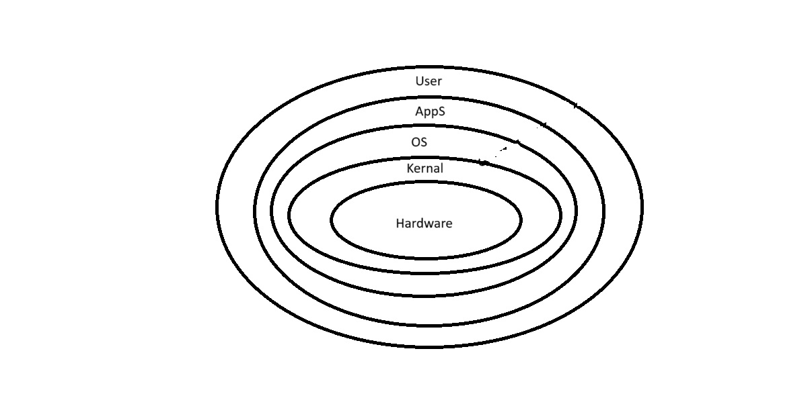
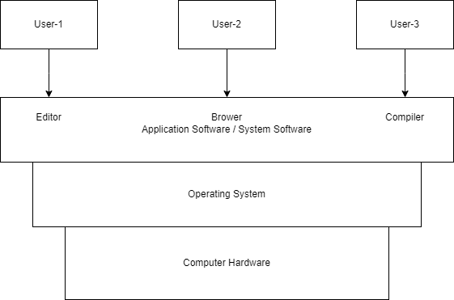
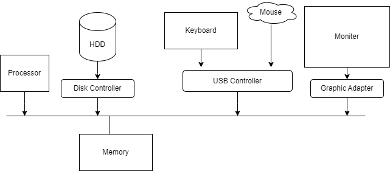
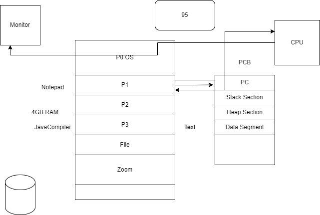

### OS Notes Day-1 Date: 24-02-2025
#### Session-1: Introduction to Operating System
- What is OS?
    - Hardware Manager: It manage all the hardware resources or components of computer.
    - Process Manager: It supervise all the task/process/job which is being executed by processor.
    - It is an Interface between Hardware and User.

- How is it different from other application software?
    - OS is installed over hard-drive.
    - Applications are also installed over hard-drive but under the layer of OS.
    - OS runs over computer system, and Applications runs over OS.
- Booting: Loading of OS from hard drive to main memory is known as Booting
    - Cold Booting: When we are starting computer system from totally power off condition and OS code loaded into main memory. 
    - Hot Booting: When the system is already running and we re-start the system, then firstly RAM is totally cleared and OS code is loaded again into RAM.
- Why OS is hardware dependent?
    - TODO
- Different components of OS

- Basic computer organization required for OS.

- Examples of well-known OS
    - Mobile OS: Android, iOS, Windows
    - Embedded OS: 
    - Real Time OS: HRT, SRT
    - Desktop OS: Windosq, MacOS, Chrome OS
    - Sever OS: Cent7 OS, Ubuntu Server
- TO DO:How are these different from each other and why?
- Functions of OS:
    - Process Management (Process Scheduling Algo)
    
    - Device Management
    - Disk Management (Disk Scheduling Algos)
    - File Management
    - Network Management
    - Security Management (Firewall, Anti Virus, BIOS)
#### Will be discussed tomorrow
- User and Kernel space and mode; 
- Interrupts and system calls
- Memory Hierarchy in Computer System
- Types of Operating System
#### Session-2: Introduction to Linux
- It is an open source operating system. It is available for the user for free of cost. User can modify its code w.r.t. their need.
- The founder of linux OS is Linus Torvards. It is launched in year 1991.
- An Open Source Community is working behind its continous support and upgradation.
- Feature:
    - No Cost/ Low Cost
    - Multi-Tasking
    - Security
    - Customizable
    - Multi-User
    - Better File System
    - CLI and GUI
- Working basics of file system
    - / it is known root directory
        - /bin: User bineries
        - /sbin: System Bineries
        - /etc: Configuaration files
        - /dev: Device Files
        - /proc: Process Information
        - /var: Variables Files
        - /tmp: Temporaray files
        - /usr: User Directory
        - /Home: Parent directory for user
        - /log: 
- Commands associated with files/directories & other basic commands.
- Operators like redirection, pipe