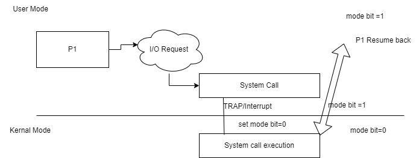
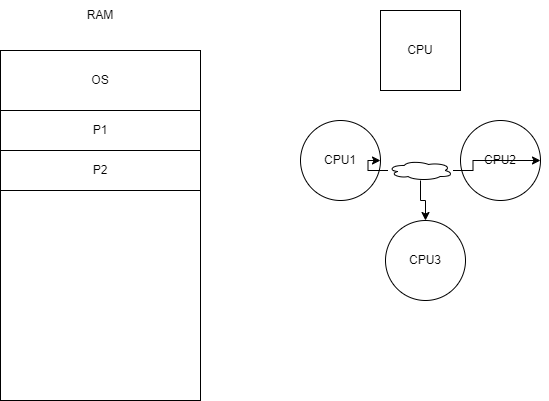
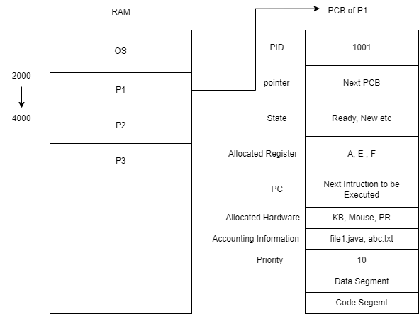
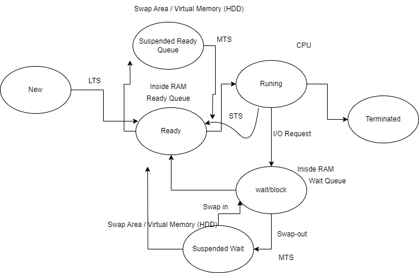
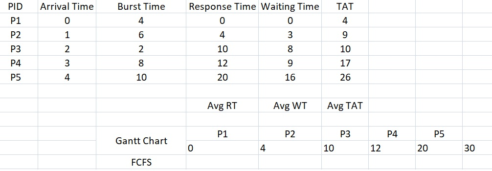
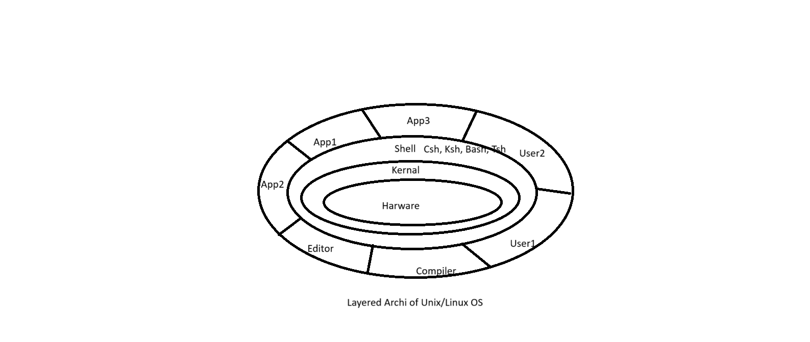
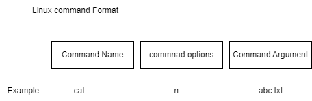
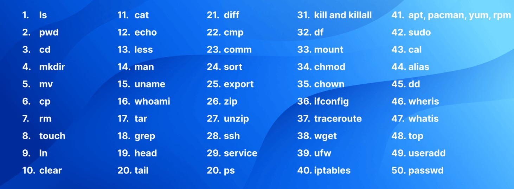

### OS Notes Day-2 Date: 26-02-2025
#### Lets revise Session-1: Introduction to Operating System
- What is OS?
- How is it different from other application software?
- Booting
- Why OS is hardware dependent?
- Different components of OS
- Basic computer organization required for OS.
- Examples of well-known OS
- TO DO:How are these different from each other and why?
- Functions of OS
- Introduction to Linux, Features and Directories Structure
#### OS Introduction and Basic Functions
- User and Kernel space and mode

- Interrupts and system calls
    - File Related: Open(), Close(). Read(), Write(), Execute, Delete(), Create()
    - Process Related: New(), fork(), wait(), running()
    - Device Related: read(), uptime, getime etc.
    - Information Related: getpid, getppid, sysdata
    - Communication Related (IPC): wait(), notify(), notifyall()
- Types of Operating System
    - Bathc OS
    - Multi-Programming OS
    - Multi-Tasking OS
    - Multi Processing OS
    - Clustered OS
    
    - Distributed OS
    - Embedded OS
#### Process Magagement
- What is process: A program / application loaded in RAM is known as process.
    - preemptive: If a process can be interupted while its execution and resumed back later that process is known as pre-emptive process.
    - non-preemptive processes: If a process can not be interupted while its execution that process is known as non pre-emptive process.
- Every process have its control block which is known as Process Control Block

- Process life cycle

- What are schedulers (Please briefly read them)
    - Short Term
    - Medium Term
    - Long Term
- Process scheduling algorithms 
    - FCFS (First Come First Serve)
        - processes are scheduled according to their arrival time
        
#### To be discussed tomorrow morning (27-02-2025)
- Memory Hierarchy in Computer System
- Shortest Job First (Shortest Job First)
- Priority ()
- RR (Round Robin): 
- Queue. 
- Belady’s Anomaly
- Examples associated with scheduling algorithms to find turnaround time to find the better performing scheduler.
- Process creation using fork; waitpid and exec system calls; Examples on process creation;
    - Parent and child processes
    - Orphan and zombie processes
#### Linux and some Usefull commands
##### Let us revise
- It is an Open Source operating system. It is available free to use and user can modify it according their need.
- The founder or linux is Linun Torvards. It available since 1991.
- An Open Source Community is woking behind the updation and upgradation of the linux code.
- Feature
    1. No Cost / Low Cost
    2. Multi-Tasking
    3. Security
    4. Multi-User
    5. Stable and Scalable
    6. Networking
    7. CLI as well as GUI
    8. Better File System
- Unix/Liux OS Architecture

- Working with basics file system of Linux
- / is root directory
    1. /bin: User Bineries
    2. /sbin: System Bineries
    3. /etc: Configuration Files
    4. /dev: Device Files
    5. /proc: Process Information
    6. /var: Variables Files
    7. /tmp: Temporary Files
    8. /usr: User Programs
    9. /home: Parent directory of user friendly directory
    10. /boot: Boot Loader Files
    11. /opt:Apps
    12. /lib: System Libraries
- Commands associated with files/directories

    1. pwd: Present Working Directory
    2. ls: it list out all the files and directory of current working directory
    3. nano: it actually run the nano editor and open the specified file.
    4. touch: It is used to create a new file
    5. mkdir: To create a new directory.
    6. chmod: to give and revoke the file or directory permissions
    7. rm: to remove file and recursive directory
    8. rmdir: to remove a prticuler directory
    9. cd: to change directory
- Ref: https://ubuntu.com/tutorials/command-line-for-beginners#1-overview

- What is shell?
    - Shell is interface b/w user and kernal.
    - It take input from user and pass it on to the kernal.
    - An user can interact with kernal by using shell commands or shell script / program.
- What are different shells in Linux?
    - /bin/sh
    - /bin/bash
    - /usr/bin/bash
    - /bin/rbash
    - /usr/bin/rbash
    - /usr/bin/sh
    - /bin/dash
    - /usr/bin/dash
    - /usr/bin/tmux
    - /usr/bin/screen
- Shell variables
    - Shell varibale can be defined using any name without the type of the variable
- Example:
```sh
X=100;          //X will store value 100
Y="Malkeet"     //Y will store the value "Malkeet"
echo $X         //To access the variable you should use $ sign before the variable name
```
- Read: Its is used to read input from keyboard
- Echo: It used to print output something in screen.
#### To be discussed tomorrow evening (27-02-2025)
- Operators like redirection, pipe
- What are file permissions and how to set them?
- Permissions (chmod, chown, etc)
- access control list
##### Shell Programming
- Shell variables
- Wildcard symbols
- Shell meta characters
- Command line arguments
- more use of Read, Echo
- Decision loops (if else, test, nested if else, case controls, while…until, for)
- Regular expressions
- Arithmetic expressions
- More examples in Shell Programming