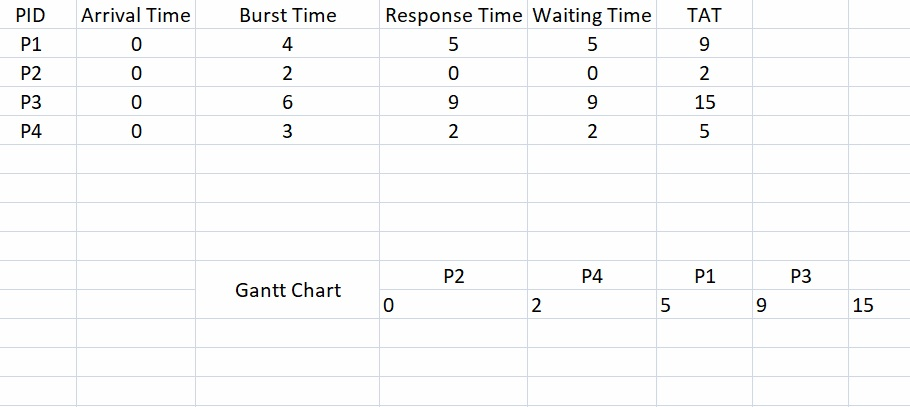
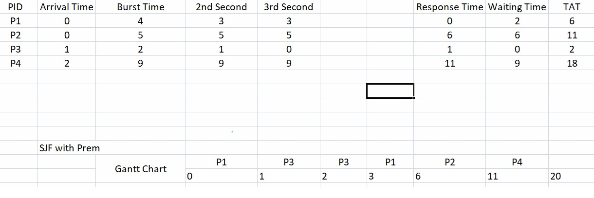
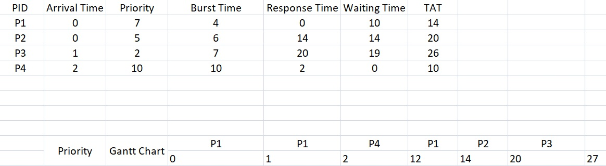
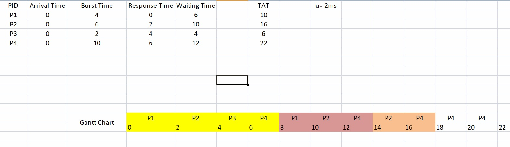
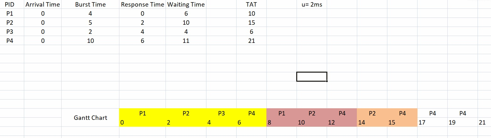

### OS Notes Day-3 Date: 27-02-2025
#### Lets revise 
- User and Kernel space and mode
- Interrupts and system calls
    - Hardware Interrupt
        - RST 7.5    
    - Software Interrupt (System Calls)
- Types of Operating System
- Process life cycle
- What are schedulers
- Process scheduling algorithms 
#### Process scheduling algorithms
##### Memory Hierarchy
- Memory hierarchy is a structured arrangement of different storage types used in a computer system. It is designed to balance cost, capacity, and access speed by placing small, fast, and expensive memory close to the CPU and larger, slower, and cheaper memory further away.
- Levels of Memory Hierarchy:
    - Registers:
        - Location: Inside the CPU.
        - Characteristics: Extremely fast and very limited in number.
        - Use: Holds the operands and results of arithmetic operations.
    - Cache Memory:
        - Types: Typically divided into L1 (fastest and smallest), L2 (larger but slightly slower), and sometimes L3 (even larger and shared among cores).
        - Characteristics: Provides a temporary storage area for frequently accessed data to reduce the average time to access data from the main memory.
        - Principle: Operates based on the principles of temporal and spatial locality.
    - Main Memory (RAM):
        - Characteristics: Larger capacity compared to cache but slower in terms of access speed.
        - Use: Holds the bulk of the data and code that the CPU is actively using.
    - Secondary Storage:
        - Examples: Hard Disk Drives (HDDs), Solid-State Drives (SSDs).
        - Characteristics: Much larger in capacity, non-volatile, but significantly slower than RAM.
        - Use: Used for long-term data storage and retrieval.
    - Tertiary/External Storage:
        - Examples: Optical disks, magnetic tapes, and cloud storage systems.
        - Characteristics: Often used for backup, archival purposes, or rarely accessed data.
- Key Takeaways:
    - Cost vs. Speed Trade-off: Faster memories are more expensive per bit, so systems use a combination to optimize performance.
    - Locality Principles: Temporal locality (recently accessed data is likely to be accessed again) and spatial locality (data near recently accessed data is likely to be accessed soon) drive efficient memory hierarchy designs.
##### Process Scheduling Algo
- Shortest Job First (SJF) Scheduling
    - Shortest Job First (SJF) is a scheduling algorithm that selects the process with the smallest execution time (or CPU burst) to run next. It is designed to minimize the average waiting time of processes in the queue.
    - Key Characteristics:
        - Optimality: SJF is proven to be optimal in terms of average waiting time if all processes arrive simultaneously.
    - Types:
        - Non-preemptive SJF: Once a process starts executing, it runs to completion.
        - Preemptive SJF (Shortest Remaining Time First - SRTF): A newly arriving process can preempt the current one if its remaining time is shorter.
    - Drawback:
        - Starvation: Longer processes may wait indefinitely if shorter processes continuously arrive.
- Example-1: Non Preemptive

- Example-2: Preemtive

- Priority Scheduling
    - Priority scheduling assigns a priority to each process. The CPU is allocated to the process with the highest priority. Priorities can be either static (assigned at creation) or dynamic (changed over time).
    - Types:
        - Preemptive Priority Scheduling: A running process can be interrupted if a new process with a higher priority arrives.
        - Non-preemptive Priority Scheduling: Once a process starts executing, it continues until completion even if a higher priority process arrives.
    - Potential Issue:
        - Starvation: Lower priority processes may never execute if higher priority processes continue to arrive. This can be mitigated by using aging (gradually increasing the priority of waiting processes).
- Example-1:

- Round Robin (RR) Scheduling
    - Round Robin (RR) is a pre\emptive scheduling algorithm particularly suitable for time-sharing systems. Each process is assigned a fixed time quantum (or time slice), and processes are cycled through in a circular queue.
    - Key Characteristics:
        - Fairness: Every process gets an equal share of the CPU.
        - Time Quantum: The duration of the time slice is crucial:
        - Too Small: Can lead to high context switching overhead.
        - Too Large: Can make the algorithm behave like First-Come, First-Served (FCFS).
        - Preemptiveness: Processes are preempted if they do not complete within their allotted quantum, and are placed at the end of the queue.
        - Responsiveness: Especially important in interactive systems where users expect a responsive system.
- Example-1:

- Example-2: Reduced Quantum

#### Linux's Usefull commands, Shell Scripting
- Decision loops in shell scripting / programming 
    - if else
-Syntax:
```sh
if [ condition ]
then
    statement
else
    statement
fi (end of if)
```
- Example:
```sh
echo "Enter Num1"
read Num1
if [ $Num1 -eq 5 ]
then
        echo "Number is equal to 5"
else
        echo "Number is not equal to 5"
fi
```
    - nested if- else
- syntax:
```sh
if [ condition ]  //Outer-if
then
    if [ condition ]   //Inner-if in if part
    then
        statement
    else //else part of inner-if
        statement
    fi (end of inner if)
else //else of outer if
    if [ condition ]
    then
        statement
    else //else of inner if 
    fi (end of inner if)
fi (end of outer if)
```
- Example: Nested if-else
```C
echo Enter Num1
read Num1
echo Enter Num2
read Num2
echo Enter Num3
read Num3
if [ $Num1 -gt $Num2 ]
then
if [ $Num1 -gt $Num3 ]
then
        echo Num1 is greatest
else
        echo Num3 is greatest
fi
else
        if [ $Num2 -gt $Num3 ]
then
        echo Num2 is greatest
else
        echo Num3 is greatest
fi
fi
```
- test command
- Example-1:
```sh
#!/bin/bash
x=100
y=200
if test $x -eq $y
then
echo x and y are equal
else
echo x and y are not equal
fi
```
- Please try: -eq, -gt, -le, -ge, -lt these operators with test command
- Example-2
```sh
#!/bin/bash

x=Malkeet
y=Malkeet
if test $x == $y
then
echo x and y are equal
else
echo x and y are not equal
fi
```
- Please try: >, <, ==, empty these operators with test command
- loops in shell programming
    1. for: It is used to repeat certain code upto n no. of time.
- Syntax:
```sh
a=0
for a in 1 2 3 4 5 6
do
echo $a
done
```
- Example-1
```sh
#!/bin/bash
a=0
for a in 1 2 3 4 5
do
echo $a
done
```
- Example-2
```sh
#!/bin/bash
a=0
sum=0
for a in 1 2 3 4 5
do
echo $a
sum=`expr $sum + $a`
done
echo Sum is, $sum
```
##### To do in the Lab
1. Sum of n Odd numbers
2. Sum of n even numbers
3. To find whether number is a prime or not
4. Fibbonacci series upto n  numbers
5. Factorial of number
6. Table of a number
#### To be discussed tomorrow (28-02-2025)
##### Memory Management 
- Continuous and Dynamic allocation
- First Fit, Best Fit, worst Fit
- Compaction
- Internal and external fragmentation
- Paging:
    - What is paging?
    - hardware required for paging
    - paging table
    - Translation look aside buffer
- Concept of dirty bit
- Shared pages and reentrant code
- Throttling
- IO management
- Virtual Memory
    - What is virtual memory
    - Demand paging
    - Page faults
    - Page replacement algorithms
    - Belady's Anomly
- Segmentation:
    - What is segmentation?
    - Hardware requirement for segmentation.
    - segmentation table and its interpretation
##### Linux and Shell Programming
- Permissions (chmod, chown, etc)
- access control list
- Shell variables
- Wildcard symbols
- Shell meta characters
- Command line arguments