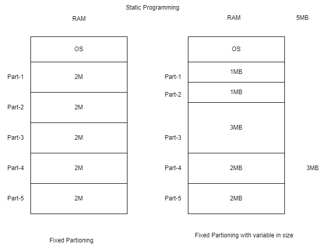
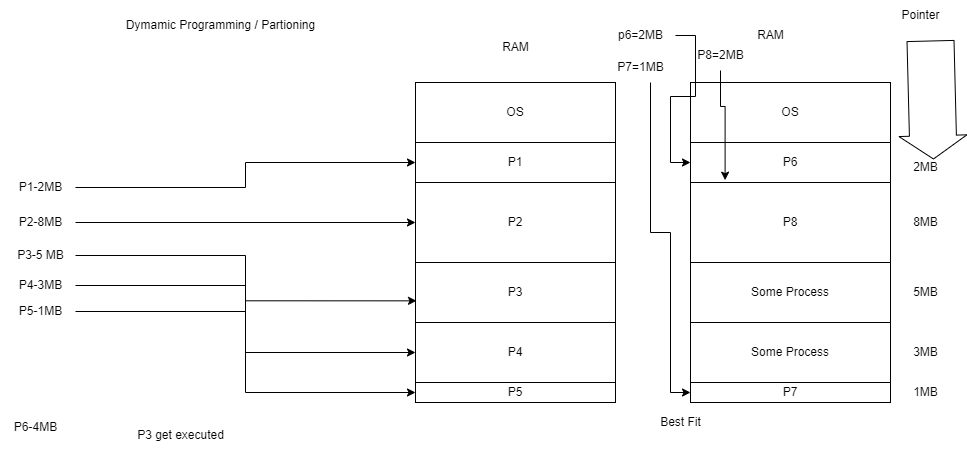
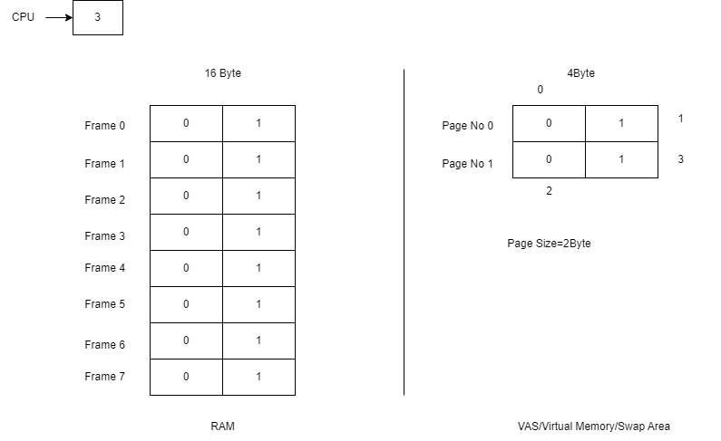
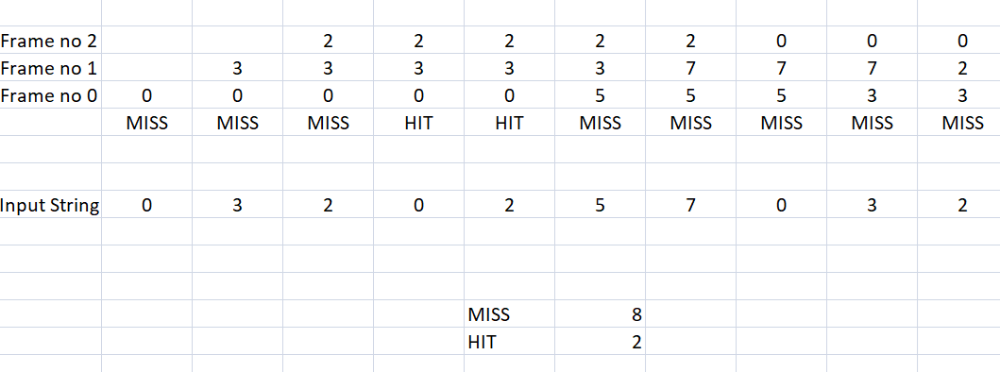
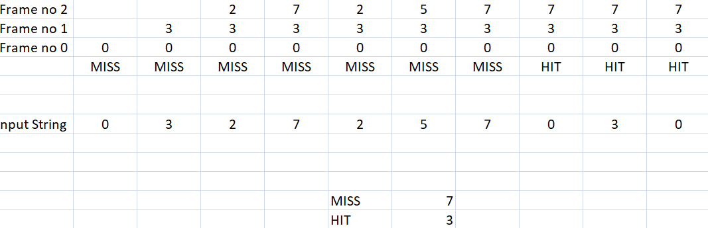
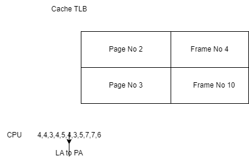
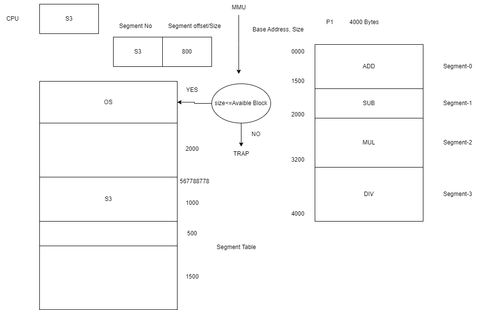

### OS Notes Day-4 Date: 28-02-2025
#### Lets revise 
- Memory Hierarchy
- Process Scheduling Algo
    - Shortest Job First (SJF) Scheduling (Preemptive and Non Preemptive)
    - Priority Scheduling
    - Round Robin (RR) Scheduling
    - Redirection (>,>>) and Piping (|) in linux shell commands
    - Control statements in Shell Scripting e.g. if-else, nested if-else, for loop
#### Memory Management
- Static Partitioning: Early systems used fixed-sized partitions, where each process occupied one contiguous block.
    - Drawbacks:
        - Can lead to external fragmentation.
        - Processes must be loaded into contiguous spaces, which can be inefficient if free memory is scattered.

- First Fit, Best Fit, Worst Fit
    - These are strategies used by the operating system to allocate free memory blocks to processes:
    - First Fit:
        - Mechanism: The allocator scans the memory from the beginning and chooses the first free block that is large enough for the process.
        - Pros:
            - Simple and fast allocation.
        - Cons:
            - May leave small unusable gaps (external fragmentation) near the beginning of memory.
        - Example:
            - Suppose free blocks are of sizes 50, 200, 100, and a process requires 75 units. First Fit would allocate the 200-unit block if it is the first encountered that fits (if the 50-unit block is too small).
    
    - Best Fit:
        - Mechanism: The allocator searches the entire free memory list and chooses the smallest block that is large enough to satisfy the request.
        - Pros:
            - Minimizes wasted space within the allocated block.
        - Cons:
            - Can be slower due to searching the entire list.
            - May leave many very small fragments.
        - Example:
            - With free blocks of sizes 50, 200, 100 and a request of 75 units, Best Fit would choose the 100-unit block, as it’s the smallest block that fits.
    - Worst Fit:
        - Mechanism: The allocator chooses the largest available block, under the assumption that splitting a large block leaves a large remainder that might be more useful later.
        - Pros:
            - Tends to leave a larger remainder, which could be useful for future requests.
        - Cons:
            - Can quickly reduce the size of the largest block available.
            - Not as commonly used in modern systems.
        - Example:
            - Given free blocks of sizes 50, 200, 100 for a 75-unit request, Worst Fit would choose the 200-unit block, splitting it into a 75-unit allocation and leaving a 125-unit free block.
- Internal and External Fragmentation
    - Internal Fragmentation:
        - Definition: Occurs when allocated memory may have some unused space within it, often because memory is allocated in fixed-sized blocks.
        - Example:
            - If a process requires 70 bytes and the allocation unit is 100 bytes, 30 bytes are wasted within that block.
    - External Fragmentation:
        - Definition: Occurs when free memory is split into small blocks scattered throughout memory. Even if the total free memory is sufficient, there may be no single contiguous block large enough to satisfy a request.
        - Example:
            - Memory has free blocks of sizes 30, 20, and 40 bytes scattered between processes. A request for 50 bytes cannot be satisfied even though 90 bytes are free in total.
- Compaction/Defragmentation
    - Compaction is the process of rearranging the contents of memory to place all free memory together in one large block. This is typically done to overcome external fragmentation.
    - Process:
        - The operating system shifts processes in memory so that all allocated memory becomes contiguous.
        - The free spaces merge into a single block that can be used to satisfy larger allocation requests.
    - Compaction is time-consuming and may require the relocation of processes (updating pointers, tables, etc.), so it is used sparingly.
- Paging
    - Dividing the process into fixed sizes pages is know as paging.
    - Why Paging: Instead of loading the whole process which can't be loaded into main memory OS loads few pages of the process into main memory accoring to frames available and other pages loaded from storage device on demand of CPU.

- Paging table: It is a special table maintained by MMU (Memory Management Unit) to map the logical address of the demanded page with the physical address of the page in main memory where actualy the page is placed.
- Demand paging
    - If the page is loaded in memory frame as per the demand of CPU i.e. known as demand paging.
- Page faults: If CPU demands a page and its not there in main memory. That time an interrupt generated to load the page from virtual memory / hard-drive.
- Page replacement algorithms
    1. FIFO (First in First Out)
    
    - Belady's Anomly: It state that if we increase the number of frames, the HIT Ratio decreased. 
    2. LRU (Optimal Page Replacement): to be disscussed
    3. MRU (LIFO)
    
- Hardware required for paging (Virtual + Cache)
- What is virtual memory
    - Its a memory space in hard-drive, which work like physical memory to entertain large processes whose size is bigger than the RAM. It is an illusion memory.
    - In Virtual Memory process is divided into fixed sized partions know as pages.
    - OS loads the process's pages from virtual memory to physical memory on demand of CPU i.e. known as Demand Paging.
    - While working with virtual memory pages are saved as per their logical address.
    - While loading the pages from virtual memory to physical memory the pages get physical address.
    - If a page loaded from virtual memory to physical memory i.e. know as swap-in process.
    - If the page is shifted from physical memory to logical memory by the replacement process i.e. know swap out.
- Translation look aside buffer
    - It is a page table represented in cache memory to fasten the process of finding physical address for a given logical address.
    
    - In paging we load only few pages in main memory of a particuler process. Entries of that pages is made in MMU Page Table which is actually present at physical memory. To find a frame MMU first look into page table and then according page table entry it accress the given frame no. This process is actually access the RAM twice. So to reduce this access OS use Translation Look Aside Buffer in cache memory.
- Concept of dirty bit
    - It is a bit in page table which describe either the page content is updated during the execution or not. If for a specific frame the content is updated then its dirty is set to 1, other wise its always 0.
- What is Segmentation?
    - Segmentation divides a program’s memory into logical segments such as code, data, and stack. Each segment is a variable-sized block and is treated as a separate unit.
    - Benefits:
        - Allows for logical organization and protection of different types of data.
        - Segments can be shared between processes if needed.
    - Hardware Requirements for Segmentation
        - Segmentation Registers:
            - The CPU includes special registers (such as the segment base and limit registers) that hold information about the segments.
        - Memory Management Unit (MMU):
            - The MMU uses the segmentation registers to translate logical addresses (segment:offset) into physical addresses.
        - Protection and Limit Checks:
            - Hardware supports boundary checking using the segment limit, ensuring that processes cannot access memory outside their assigned segments.
- Segmentation Table and Its Interpretation
    - A segmentation table (or segment descriptor table) contains entries for each segment, detailing the base address, length (limit), and access rights.
    - Typical Entry Contains:
        - Segment Number: Identifier for the segment.
        - Base Address: The starting physical address of the segment.
        - Limit: The size of the segment (defines the maximum offset within the segment).
        - Access Rights/Attributes: Read, write, execute permissions.
        
- Example Interpretation:
    - Suppose a segmentation table entry for a code segment shows a base address of 0x1000, a limit of 0x0FFF, and execute permission. A logical address given as segment:offset is translated by adding the offset to 0x1000 after verifying that the offset does not exceed 0x0FFF.
##### Linux and Shell Programming
- TODO: Kindly explore more about Permissions (chmod, chown, etc) 
- while loop in shell scripting
- Syntax:
```sh
while [ condition ]
do
statement
increment
done
```
- Example-1
```sh
#!/bin/bash
a=0
while [ $a -lt 10 ]
do
echo $a
a=`expr $a + 1`
done
```
- until loop in shell scripting
- Syntax:
```sh
a=0
until [ $a -gt 10 ]
do
statement
increment expresion
done
```
- Example-1
```sh
#!/bin/bash
a=0
until [ $a -gt 10 ]
do
echo $a
a=`expr $a + 1`
done
```
- Wildcard symbols
    1. Question Mark ?
    2. Asterisk *
    3. Square Braces []
    4. Curly Braces {}
    5. Sign of Exclamation [!]
    6. Backslash \
- Ref: https://tldp.org/LDP/GNU-Linux-Tools-Summary/html/x11655.htm
- Shell meta characters ( > , >> , < , | , ; , && , '' , "" , /)
    1. Pipe (|): Piping allow us to filteartion among the result of the command. e.g. cat file2 | grep ^h
    2. Redirection (>): It allow you to use output of one command as an input of other command
    3. Asterisk (*)
    4. Tilde (~): Used for going back to the user's home directory
    5. Doller Symbol ($): It is aslo used to matching the end of the string for a line in a file.
    6. Caret (^): It is used to match the starting of the string withinggiven file
- Ref: https://opensource.com/article/22/2/metacharacters-linux
- Command line arguments
    - Special Parameters in Shell while passing command line arguments
        1. $#: No. of parameters passed
        2. $0: Script Name
        3. $i: where i can be any number, it will return that parameter
        3. $*: Give all parameters passed
```sh
#!/bin/bash
echo Number of Param, $#
echo Script Name, $0
echo Hello, $1
echo Hii, $2
echo Ok, $3
echo Bye, $*
```
- Regular expressions
    - | grep ^S: It will filter the pipeline and get the words which are starting with S
    - | grep ^n.*f$: It will filter the pipeline and get the lines which are starting with n and ending f
    - ls f*: It will return all the file starting with f
- Arithmetic expressions
    - $a + $b
    - $a - $b
    - $a / $b
    - $a * $b
```sh
#!/bin/bash
echo Enter a Number
read Num1
echo Enter a Number
read Num2
Res=`expr $Num1 \* $Num2`
echo Result, $Res
```
- Network Commands
    - telenet: It is used to take the control of remote server / machine
    - ftp: File Transfer Protocol, It allow user to send or recieve file from remote server / machine
    - ssh: It is also used to take control of remote server / machine
    - sftp: Secure FTP
    - finger:
#### Reading Assigment
- waitpid and exec system calls
- Shared pages and reentrant code
- Throttling
- access control list
- network commands (telenet, ftp, ssh, sftp, finger)
- System variables like – PS1, PS2 etc. How to set them
##### To be disscussed tomorrow (28-02-2025)
- Deadlock
    - Necessary conditions of deadlock
    - Deadlock prevention and avoidance
    - Semaphore 
    - Mutex
    - Producer consumer problem
    - Dead-lock vs Starvation